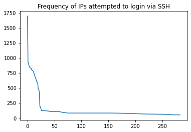
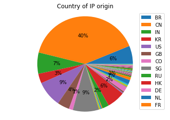
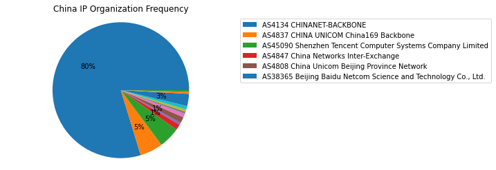

# parse-malicious-ssh-logs
###### Colab notebook to parse malicious ssh brute-force login attempts

To annotate IPs, I used IPinfo's [bulk upload](https://ipinfo.io/account/bulk-upload) (you'll need an account for this but free account has 50k lookups per month). You can use other services like DBIP or Censys for geolocation tagging.

## Analysis example
This script analyze failed ssh attempts from `/var/log/auth.log` and plot geolocation distribution. 

The IP frequency ranged from 1 to 1700, with the average of 284 attempts per IP. The 1500+ IPs are located in 40 countries including China (40%), India (7%), Brazil (6%). They were also trying some common names like admin, user, git, debian, etc...

IPs originated from China are mainly from CHINANET-BACKBONE: 
